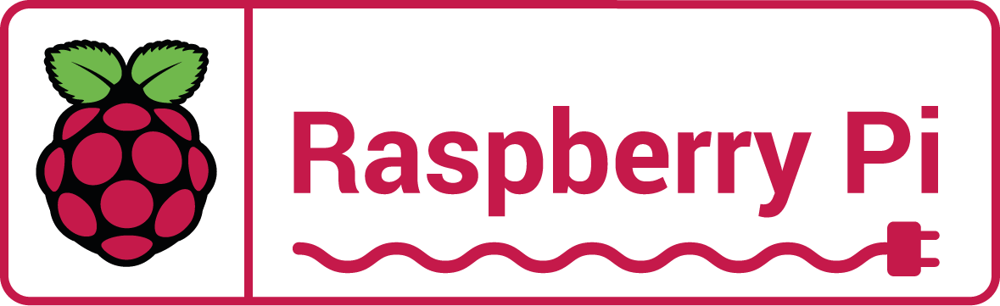

# MP14-Raspberry Grup4

## Descripción del Proyecto
El proyecto MP14-Raspberry consiste en desarrollar una aplicación para Raspberry Pi que permita controlar dispositivos conectados a través de la plataforma IoT. La aplicación se encargará de gestionar la comunicación con los dispositivos, así como de proporcionar una interfaz de usuario para el control remoto.

## Requisitos Mínimos de Raspberry Pi

- **Integrar una Raspberry Pi como centro de control: Configurar y programar la Raspberry Pi para que funcione como el cerebro de la casa domótica, gestionando la comunicación y control de los dispositivos y sensores.

- **Implementar una cámara de vigilancia: Instalar y configurar una cámara compatible con la Raspberry Pi para la vigilancia y monitorización remota de la casa.

- **Integrar un sensor de movimiento: Conectar y programar un sensor de movimiento para detectar intrusiones y activar alarmas o notificaciones de seguridad.

- **Incorporar un sensor de temperatura: Instalar un sensor de temperatura para monitorear y controlar el clima dentro del hogar, ajustando automáticamente la calefacción o el aire acondicionado según sea necesario.

- **Desarrollar una interfaz de usuario: Crear una interfaz de usuario intuitiva y fácil de usar para controlar y monitorear los dispositivos y sensores de la casa domótica desde un dispositivo móvil o una computadora.

## Objetivos del Proyecto
- Desarrollar una aplicación funcional que permita controlar dispositivos IoT desde una Raspberry Pi.
- Configurar la Raspberry Pi con el sistema operativo y los componentes necesarios para ejecutar la aplicación de manera eficiente.
- Probar la aplicación y realizar ajustes según sea necesario para garantizar su estabilidad y rendimiento.

