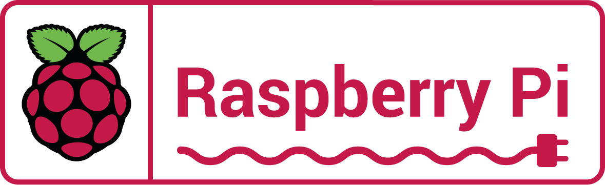

# MP14-Raspberry Grup4

## Descripción del Proyecto
El proyecto MP14-Raspberry consiste en desarrollar una aplicación para Raspberry Pi que permita controlar dispositivos conectados a través de la plataforma IoT. La aplicación se encargará de gestionar la comunicación con los dispositivos, así como de proporcionar una interfaz de usuario para el control remoto.

## Requisitos Mínimos de Raspberry Pi

- **Modelo de Raspberry Pi**: Compatible con las especificaciones mínimas para ejecutar el sistema operativo y la aplicación.
- **Memoria RAM**: Se recomienda al menos 1 GB para un rendimiento adecuado.
- **Almacenamiento**: Suficiente espacio para el sistema operativo, la aplicación y los datos.
- **Conectividad a Internet**: Necesaria para la comunicación con dispositivos IoT y la gestión remota.
- **Puertos GPIO**: Requeridos para conectar y controlar dispositivos.
- **Sistema Operativo**: Instalar un sistema compatible, como Raspbian, y configurarlo adecuadamente.

## Objetivos del Proyecto

- **Integrar una Raspberry Pi como centro de control**: Configurar y programar la Raspberry Pi para que funcione como el cerebro de la casa domótica, gestionando la comunicación y control de los dispositivos y sensores.

- **Implementar una cámara de vigilancia**: Instalar y configurar una cámara compatible con la Raspberry Pi para la vigilancia y monitorización remota de la casa.

- **Integrar un sensor de movimiento**: Conectar y programar un sensor de movimiento para detectar intrusiones y activar alarmas o notificaciones de seguridad.

- **Incorporar un sensor de temperatura**: Instalar un sensor de temperatura para monitorear y controlar el clima dentro del hogar, ajustando automáticamente la calefacción o el aire acondicionado según sea necesario.

- **Desarrollar una interfaz de usuario**: Crear una interfaz de usuario intuitiva y fácil de usar para controlar y monitorear los dispositivos y sensores de la casa domótica desde un dispositivo móvil o una computadora.

## Instalacion Raspberry

### Requisitos instalacion

- **Camara**
- **Sensor movimiento**
- **Sensor temperatura**
- **Raspberry**
- **Teclado/raton**
- **Mini hdmi**
- **Cables alimentacion**

###Instalacion fisica Raspberry
![Hola(capturas/20240527_211104.jpg)

