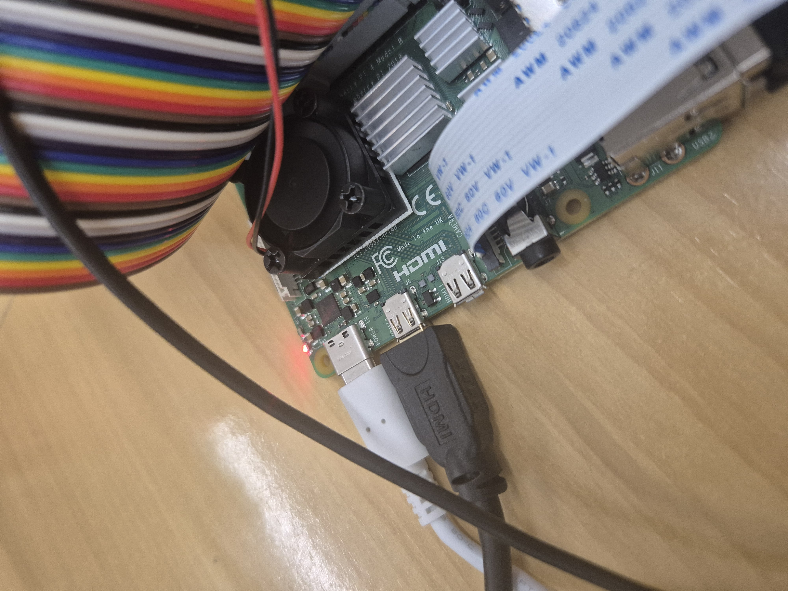
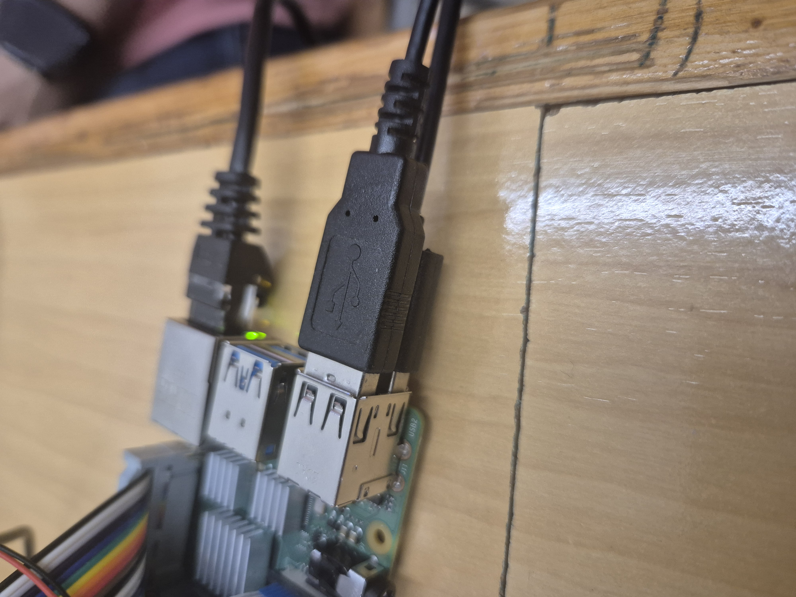
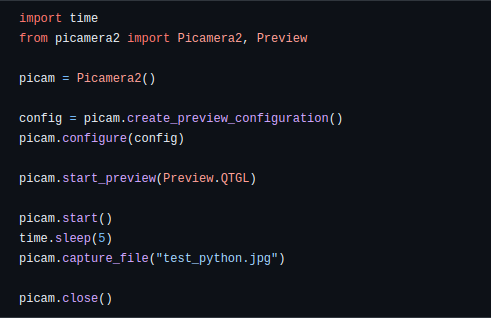

# MP14-Raspberry Grup4


## Descripción del Proyecto
El proyecto MP14-Raspberry consiste en desarrollar una aplicación para Raspberry Pi que permita controlar dispositivos conectados a través de la plataforma IoT. La aplicación se encargará de gestionar la comunicación con los dispositivos, así como de proporcionar una interfaz de usuario para el control remoto.

## Requisitos Mínimos de Raspberry Pi

- **Modelo de Raspberry Pi**: Compatible con las especificaciones mínimas para ejecutar el sistema operativo y la aplicación.
- **Memoria RAM**: Se recomienda al menos 1 GB para un rendimiento adecuado.
- **Almacenamiento**: Suficiente espacio para el sistema operativo, la aplicación y los datos.
- **Conectividad a Internet**: Necesaria para la comunicación con dispositivos IoT y la gestión remota.
- **Puertos GPIO**: Requeridos para conectar y controlar dispositivos.
- **Sistema Operativo**: Instalar un sistema compatible, como Raspbian, y configurarlo adecuadamente.

## Objetivos del Proyecto

- **Integrar una Raspberry Pi como centro de control**: Configurar y programar la Raspberry Pi para que funcione como el cerebro de la casa domótica, gestionando la comunicación y control de los dispositivos y sensores.

- **Implementar una cámara de vigilancia**: Instalar y configurar una cámara compatible con la Raspberry Pi para la vigilancia y monitorización remota de la casa.

- **Integrar un sensor de movimiento**: Conectar y programar un sensor de movimiento para detectar intrusiones y activar alarmas o notificaciones de seguridad.

- **Incorporar un sensor de temperatura**: Instalar un sensor de temperatura para monitorear y controlar el clima dentro del hogar, ajustando automáticamente la calefacción o el aire acondicionado según sea necesario.

- **Desarrollar una interfaz de usuario**: Crear una interfaz de usuario intuitiva y fácil de usar para controlar y monitorear los dispositivos y sensores de la casa domótica desde un dispositivo móvil o una computadora.

## Instalacion Raspberry

## Requisitos instalacion

- **Camara**
- **Sensor movimiento**
- **Sensor temperatura**
- **Raspberry**
- **Teclado/raton**
- **Mini hdmi**
- **Cables alimentacion**

### Instalacion fisica Raspberry

Lo principal seria conecatar el cable de alimentacion y el cable HDMI para poder tener video y asi poder hacer el proyecto.



Una vez tengamos la raspberry en marcha podriamos conectar el teclado y raton para poder desplazarnos por la raspberry y luegoel cable de red para poder obtener conexion a internet. Tambien se podria observar como esta la camara conectada en 
el sitio



Y por ultimo tendriamos el extensor donde tendriamos lo tendriamos conectado a nuestra raspberry, con el extensor puesto podremos conectar el detector de humedad y temperatura como se puede apreciar en las fotos.


## Càmara Raspberry
Per a fer us de la maquina hem tingut que fer servir el codi següent



Com a resultat de el codi anterior ens proporciona un fitxer anomenat 


## Sensor de temperatura y humedad

El script seria el siguiente:

```python
# Complete Project Details: https://RandomNerdTutorials.com/raspberry-pi-dht11-dht22-python/
# Based on Adafruit_CircuitPython_DHT Library Example

import time
import board
import adafruit_dht

# Sensor data pin is connected to GPIO 4
#sensor = adafruit_dht.DHT22(board.D4)
# Uncomment for DHT11
sensor = adafruit_dht.DHT11(board.D23)

while True:
    try:
        # Print the values to the serial port
        temperature_c = sensor.temperature
        temperature_f = temperature_c * (9 / 5) + 32
        humidity = sensor.humidity
        print("Temp={0:0.1f}ºC, Temp={1:0.1f}ºF, Humidity={2:0.1f}%".format(temperature_c, temperature_f, humidity))

    except RuntimeError as error:
        # Errors happen fairly often, DHT's are hard to read, just keep going
        print(error.args[0])
        time.sleep(2.0)
        continue
    except Exception as error:
        sensor.exit()
        raise error

    time.sleep(3.0)
```


## Hacer foto 


```python
import time
from picamera2 import Picamera2, Preview

picam = Picamera2()

config = picam.create_preview_configuration()
picam.configure(config)

picam.start_preview(Preview.QTGL)

picam.start()
time.sleep(5)
picam.capture_file("test_python.jpg")

picam.close()
```
