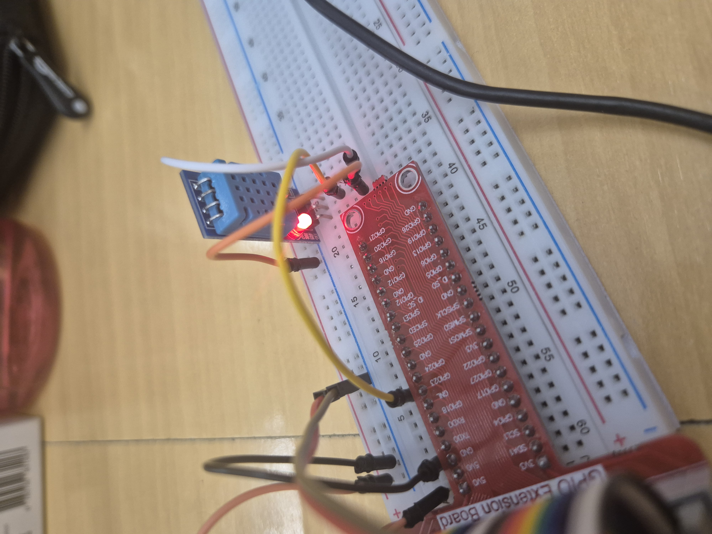

# MP14-Raspberry Grup4


## Descripción del Proyecto
El proyecto MP14-Raspberry consiste en desarrollar una aplicación para Raspberry Pi que permita controlar dispositivos conectados a través de la plataforma IoT. La aplicación se encargará de gestionar la comunicación con los dispositivos, así como de proporcionar una interfaz de usuario para el control remoto.

## Requisitos Mínimos de Raspberry Pi

- **Modelo de Raspberry Pi**: Compatible con las especificaciones mínimas para ejecutar el sistema operativo y la aplicación.
- **Memoria RAM**: Se recomienda al menos 1 GB para un rendimiento adecuado.
- **Almacenamiento**: Suficiente espacio para el sistema operativo, la aplicación y los datos.
- **Conectividad a Internet**: Necesaria para la comunicación con dispositivos IoT y la gestión remota.
- **Puertos GPIO**: Requeridos para conectar y controlar dispositivos.
- **Sistema Operativo**: Instalar un sistema compatible, como Raspbian, y configurarlo adecuadamente.

## Objetivos del Proyecto

- **Integrar una Raspberry Pi como centro de control**: Configurar y programar la Raspberry Pi para que funcione como el cerebro de la casa domótica, gestionando la comunicación y control de los dispositivos y sensores.

- **Implementar una cámara de vigilancia**: Instalar y configurar una cámara compatible con la Raspberry Pi para la vigilancia y monitorización remota de la casa.

- **Integrar un sensor de movimiento**: Conectar y programar un sensor de movimiento para detectar intrusiones y activar alarmas o notificaciones de seguridad.

- **Incorporar un sensor de temperatura**: Instalar un sensor de temperatura para monitorear y controlar el clima dentro del hogar, ajustando automáticamente la calefacción o el aire acondicionado según sea necesario.

- **Desarrollar una interfaz de usuario**: Crear una interfaz de usuario intuitiva y fácil de usar para controlar y monitorear los dispositivos y sensores de la casa domótica desde un dispositivo móvil o una computadora.

## Instalacion Raspberry

## Requisitos instalacion

- **Camara**
- **Sensor movimiento**
- **Sensor temperatura**
- **Raspberry**
- **Teclado/raton**
- **Mini hdmi**
- **Cables alimentacion**

### Instalacion fisica Raspberry

Lo principal seria conecatar el cable de alimentacion y el cable HDMI para poder tener video y asi poder hacer el proyecto.


Una vez tengamos la raspberry en marcha podriamos conectar el teclado y raton para poder desplazarnos por la raspberry y luegoel cable de red para poder obtener conexion a internet. Tambien se podria observar como esta la camara conectada en 
el sitio


Y por ultimo tendriamos el extensor donde tendriamos lo tendriamos conectado a nuestra raspberry, con el extensor puesto podremos conectar el detector de humedad y temperatura como se puede apreciar en las fotos.



## Càmara Raspberry
Per a fer us de la maquina hem tingut que fer servir el codi següent

```python
import time
from picamera2 import Picamera2, Preview

picam = Picamera2()

config = picam.create_preview_configuration()
picam.configure(config)

picam.start_preview(Preview.QTGL)

picam.start()
time.sleep(5)
picam.capture_file("test_python.jpg")

picam.close()
```

Aquest script en Python utilitza la biblioteca `picamera2` per controlar una càmera Raspberry Pi i capturar una imatge. Comença important les biblioteques necessàries i després inicialitza la càmera. Després, configura la càmera per a la previsualització i la inicia. Llavors, espera 5 segons per assegurar-se que la càmera estigui llesta i finalment captura una imatge, guardant-la com a "test_python.jpg". Finalment, tanca la connexió amb la càmera.

Com a resultat de el codi anterior ens proporciona un fitxer anomenat test_python.jpg que si l'obrim surtiria aixo:


## Sensor de temperatura y humedad

El script seria el siguiente:

```python
# Complete Project Details: https://RandomNerdTutorials.com/raspberry-pi-dht11-dht22-python/
# Based on Adafruit_CircuitPython_DHT Library Example

import time
import board
import adafruit_dht

# Sensor data pin is connected to GPIO 4
#sensor = adafruit_dht.DHT22(board.D4)
# Uncomment for DHT11
sensor = adafruit_dht.DHT11(board.D23)

while True:
    try:
        # Print the values to the serial port
        temperature_c = sensor.temperature
        temperature_f = temperature_c * (9 / 5) + 32
        humidity = sensor.humidity
        print("Temp={0:0.1f}ºC, Temp={1:0.1f}ºF, Humidity={2:0.1f}%".format(temperature_c, temperature_f, humidity))

    except RuntimeError as error:
        # Errors happen fairly often, DHT's are hard to read, just keep going
        print(error.args[0])
        time.sleep(2.0)
        continue
    except Exception as error:
        sensor.exit()
        raise error

    time.sleep(3.0)
```

Aquest codi en Python és un exemple de com llegir les dades de temperatura i humitat utilitzant un sensor DHT11 en una Raspberry Pi. El programa importa les llibreries necessàries i configura el pin al qual està connectat el sensor. Després, entra en un bucle infinit on intenta llegir les dades del sensor. Si la lectura és correcta, calcula la temperatura en graus Celsius i Fahrenheit, i mostra aquestes dades a la consola. En cas d'error en la lectura del sensor, mostra un missatge d'error i continua amb el bucle. Finalment, el programa espera un temps determinat abans de fer una nova lectura del sensor. Aquest codi és útil per monitorar la temperatura i la humitat en temps real utilitzant una Raspberry Pi i un sensor DHT11. Si necessites més informació sobre el projecte, pots visitar el lloc web proporcionat al principi del codi.

## Taula de temperatures i humetat

Ara tindrem que implementar el codi de temperatures i humetat per a generar automaticament una taula en .html i un fitxer .csv. El codi es el següent:

```python
import time
import datetime
import board
import adafruit_dht
import csv
from os.path import expanduser
import matplotlib.pyplot as plt
import mpld3

# Sensor data pin is connected to GPIO 4
# sensor = adafruit_dht.DHT22(board.D4)
# Uncomment for DHT11
sensor = adafruit_dht.DHT11(board.D23)

# Lista de tuplas para almacenar datos
data_list = []

tiempo_inicio = time.time()
tiempo_maximo = 20  # segundos

while (time.time() - tiempo_inicio) < tiempo_maximo:
    try:
        # Obtener datos del sensor
        temperatura_c = sensor.temperature
        temperatura_f = temperatura_c * (9 / 5) + 32
        humedad = sensor.humidity
        
        # Obtener fecha y hora actual
        fecha_hora_actual = datetime.datetime.now()
        
        # Almacenar datos en la lista de tuplas
        data_list.append((fecha_hora_actual, temperatura_c, temperatura_f, humedad))
        
        print("Temp={0:0.1f}ºC, Temp={1:0.1f}ºF, Humedad={2:0.1f}%".format(temperatura_c, temperatura_f, humedad))

    except RuntimeError as error:
        # Los errores son comunes, los DHT son difíciles de leer, continúa
        print(error.args[0])
        time.sleep(2.0)
        continue
    except Exception as error:
        sensor.exit()
        raise error

    time.sleep(3.0)

# Guardar los datos en un archivo CSV
nombre_archivo = expanduser("~/Desktop/datos_sensor.csv")

with open(nombre_archivo, mode='w', newline='') as archivo_csv:
    writer = csv.writer(archivo_csv)
    writer.writerow(['Fecha y Hora', 'Temperatura (ºC)', 'Temperatura (ºF)', 'Humedad (%)'])
    for data in data_list:
        writer.writerow(data)

print("Datos guardados en:", nombre_archivo)

# Función para filtrar los datos por día
def filter_by_day(day):
    filtered_data = [data for data in data_list if data[0].date() == day]
    return filtered_data

# Función para filtrar los datos por hora
def filter_by_hour(hour):
    filtered_data = [data for data in data_list if data[0].hour == hour]
    return filtered_data

# Graficar los datos
plt.plot([data[0] for data in data_list], [data[1] for data in data_list], label='Temperatura (ºC)')
plt.plot([data[0] for data in data_list], [data[3] for data in data_list], label='Humedad (%)')
plt.xlabel('Tiempo')
plt.ylabel('Valor')
plt.title('Datos del sensor DHT11 durante {} segundos'.format(tiempo_maximo))
plt.legend()
plt.grid(True)

# Convertir la figura de matplotlib a un objeto HTML para mostrar en el navegador
grafico_html = mpld3.fig_to_html(plt.gcf())

# Guardar el HTML en un archivo
nombre_html = expanduser("~/Desktop/grafico_sensor.html")
with open(nombre_html, "w") as f:
    f.write(grafico_html)

# Abrir el archivo HTML en el navegador predeterminado
import webbrowser
webbrowser.open("file://" + nombre_html)
```
Aquest script en Python recull dades de temperatura i humitat d'un sensor DHT11 connectat a una Raspberry Pi durant un període de temps específic, i després les emmagatzema en un fitxer CSV. A continuació, genera un gràfic amb les dades recollides i el mostra en un navegador web.

Primer, importa les biblioteques necessàries, incloent `time`, `datetime`, `board`, `adafruit_dht` per interactuar amb el sensor DHT11, csv per gestionar fitxers CSV, os.path per expandir la ruta d'accés al directori d'inici de l'usuari, `matplotlib.pyplot` per fer gràfics de les dades, i `mpld3` per convertir el gràfic de Matplotlib a HTML interactiu.

Llavors, configura el pin al qual està connectat el sensor DHT11 a la Raspberry Pi i crea una llista per emmagatzemar les dades recollides. També estableix el temps màxim de recollida de dades.

A continuació, inicia un bucle que recull dades de temperatura i humitat del sensor mentre el temps d'execució de l'script sigui menor que el temps màxim establert. Aquestes dades es guarden a la llista de tuples data_list.

Després de recollir les dades, s'emmagatzemen en un fitxer CSV al escriptori de l'usuari i s'imprimeix un missatge indicant la ubicació del fitxer.

Llavors, es defineixen dues funcions per filtrar les dades per dia i per hora respectivament.

Es fan gràfics de les dades de temperatura i humitat al llarg del temps utilitzant Matplotlib, i s'hi afegixen etiquetes i un títol al gràfic.

El gràfic de Matplotlib es converteix en un objecte HTML utilitzant mpld3, i es guarda en un fitxer HTML al escriptori de l'usuari. Finalment, s'obre el fitxer HTML al navegador web predeterminat del sistema per visualitzar el gràfic interactiu.

El fitxer .csv es veuria aixi:

| Fecha y Hora                | Temperatura (ºC) | Temperatura (ºF) | Humedad (%) |
|-----------------------------|------------------|------------------|-------------|
| 2024-05-13 22:02:20.777592  | 25               | 77.0             | 39          |
| 2024-05-13 22:02:24.045724  | 25               | 77.0             | 39          |
| 2024-05-13 22:02:27.303026  | 25               | 77.0             | 39          |
| 2024-05-13 22:02:32.811313  | 25               | 77.0             | 39          |
| 2024-05-13 22:02:36.071852  | 25               | 77.0             | 39          |
| 2024-05-13 22:02:39.325977  | 25               | 77.0             | 39          |


